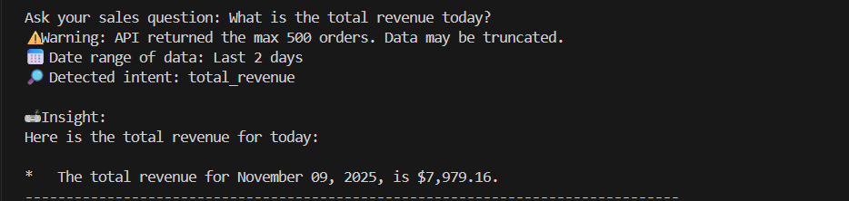
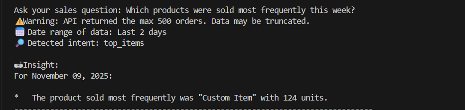
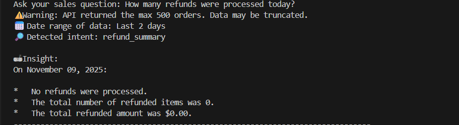
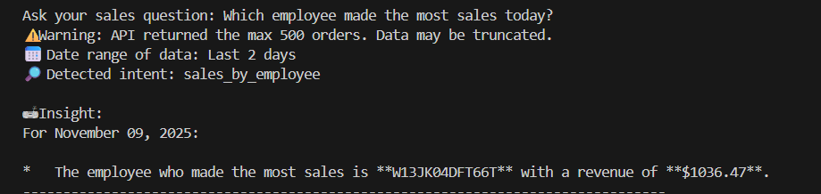
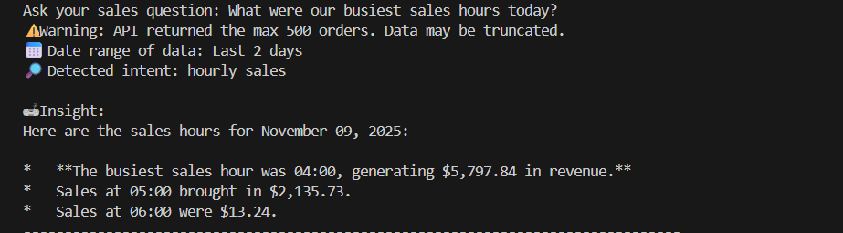
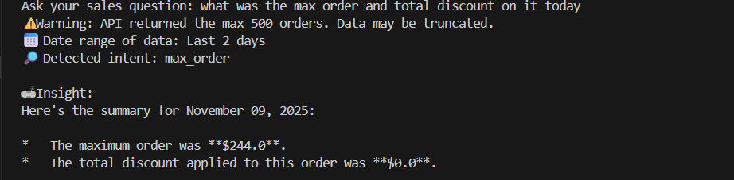
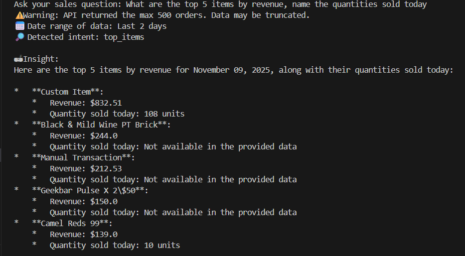

# 🧠 Sales Insight Agent (Gemini Edition)

An AI-powered CLI that answers natural-language sales questions using live data from the Mkonnekt Sales API and optionally summarizes results with Google Gemini.

This project focuses on: robust intent detection, reliable date parsing, and graceful error handling so the tool doesn’t “blame the date” unnecessarily.

---

## ✨ What it can do

The assistant understands common sales questions and computes answers directly from recent orders.

- Totals and averages
  - “total revenue” → total_revenue
  - “average order value” / “AOV” → average_order_value
- Orders (max/min/count)
  - “highest order”, “lowest order”, “how many orders” → max_order / min_order / order_count
- Products and items
  - “best selling products”, “top selling items” → shows both revenue and units-based rankings
  - “most frequent items” → by units (count)
  - “average items per order” → average_items_per_order
- Discounts and refunds
  - “maximum discount given”, “discount impact” → max_discount / discount_impact
  - “refund summary” → refund_summary
- Employees, categories, time
  - “sales by employee”, “sales by category”, “hourly sales”, “sales trend”

Example questions:

- “total revenue today”
- “best selling product and how many sold”
- “top 5 orders”
- “how many orders yesterday”
- “maximum discount given last week”
- “sales by employee for 6 Nov”

---

## 📦 Project structure

```
mkonnect_assignment/
├─ main.py                 # CLI orchestrator
├─ sales_api.py            # Fetch recent orders from Mkonnekt API (with timeout)
├─ intent_router.py        # Hybrid NLP + heuristics for intent detection
├─ query_parser_old.py     # Date parsing (relative phrases, short dates, NLP/regex)
├─ analytics_engine.py     # Sales analytics computations (revenue, units, discounts, etc.)
├─ helpers.py              # Shared helpers (format_date, date filtering, date-hint detector)
├─ requirements.txt        # Python dependencies
└─ README.md               # This file
```

---

## ⚙️ Setup

1) Python environment

```powershell
# Windows PowerShell
python -m venv .venv
.\.venv\Scripts\Activate.ps1
pip install -r requirements.txt
```

2) Install the spaCy English model (required for NLP intent/date hints)

```powershell
python -m spacy download en_core_web_sm
```

3) Configure Gemini for natural summaries

Set one of the following environment variables with your key:

- `GEMINI_API_KEY` (preferred)
- `GOOGLE_API_KEY`

You can set it in a local `.env` file or in your shell before running.

```powershell
# Example .env content
GEMINI_API_KEY=your_api_key_here
```

---

## ▶️ Run

```powershell
python main.py
```

Then type your question when prompted. Type `quit` to exit.

---

## 📅 Date handling (important)

- If your question has no date hints (e.g., “minimum sale by an employee”), the app will default to the last 2 days.
- If your question does contain a date hint but the date can’t be parsed, it will ask you to clarify instead of guessing.
- Supported inputs include:
  - “today”, “yesterday”, “past 3 days”, “last 2 weeks”, “past month”
  - Short forms like “6 nov”, “nov 6”, “7th nov”

---

## 🧮 How answers are computed

All analytics are computed directly from the fetched orders:

- Revenue/averages use order totals
- Top/lowest orders sort by total
- Best selling items by revenue and by units (when quantity is available; defaults to 1 per line item if unspecified)
- Discounts are aggregated from each order’s discounts array
- Hourly/Trend groups orders by createdTime

When the Gemini key is present, results are summarized into friendly text. If Gemini is unavailable, the tool falls back to a deterministic summary (no crash).

---

## 🛡️ Graceful error handling

- API timeout/network issues → Clear, user-friendly message; the app won’t crash.
- Empty API response (no orders) → The app explains there’s no data rather than blaming your date.
- Missing spaCy model → NLP features degrade gracefully; basic heuristics still work.
- LLM/Gemini errors → The app falls back to a deterministic summary.
- Date parsing
  - No date hints → default to last 2 days
  - Unparseable date with hint → asks you to clarify

---

## 🔍 Intent coverage (cheat sheet)

- total_revenue → “total revenue”, “total collection”, “sales amount”
- average_order_value → “average order value”, “AOV”
- max_order / min_order → “highest order”, “lowest order”
- order_count → “how many orders”, “number of orders”, “total orders”
- top_items → “best selling product/items”, “top selling”, “most sold” (returns revenue and units)
- most_frequent_items → “how many sold”, “units per item”, “most frequently sold” (units)
- average_items_per_order → “average items per order”
- discount_impact / max_discount → “discount impact”, “maximum discount given”
- sales_by_employee → “sales by employee/staff/cashier/rep”
- refund_summary → “refunds/returns/chargebacks”
- sales_by_category → “sales by category/department/section”
- hourly_sales → “hourly sales”, “busiest hour”, “peak time”
- sales_trend → “sales trend”, “over time”, “daily/weekly/monthly trend”

---

## 🖼️ Your example runs (add screenshots)

Add your own queries and screenshots here. Place image files under `results/` so they can be versioned with the project.

1) Total revenue today

- Query: "What is the total revenue today?"
- Expected intent: total_revenue
- Screenshot: ()

2) Most frequently sold products this week

- Query: "Which products were sold most frequently this week?"
- Expected intent: most_frequent_items
- Screenshot: ()

3) Refunds processed today

- Query: "How many refunds were processed today?"
- Expected intent: refund_summary
- Screenshot: ()

4) Top employee today

- Query: "Which employee made the most sales today?"
- Expected intent: sales_by_employee
- Screenshot: ()

5) Busiest sales hours today

- Query: "What were our busiest sales hours today?"
- Expected intent: hourly_sales
- Screenshot: ()

6) Three best employees

- Query: "what are the three best employees?"
- Expected intent: sales_by_employee
- Screenshot: ()

7) Max order and its total discount (multi)

- Query: "what was the max order and total discount on it today"
- Expected: two-stage (max_order → discount on that order)
- Screenshot: ()

8) Top 5 items by revenue with quantities (multi)

- Query: "What are the top 5 items by revenue, name the quantities sold today"
- Expected: combined (top_items revenue + units)
- Screenshot: ()

---

## 🧰 Troubleshooting

- “Please install 'en_core_web_sm'”
  - Run: `python -m spacy download en_core_web_sm`
- “Gemini error” or no insight generated
  - Ensure `GEMINI_API_KEY` (or `GOOGLE_API_KEY`) is set; otherwise the app will use a basic fallback summary.
- “No data available from the sales API”
  - Try again later; network/API issues may be temporary.
- “Couldn’t understand the date”
  - Add a clear date like “6 Nov”, “past 3 days”, or “yesterday”.

---

## ✅ Requirements

- Python 3.10+
- Dependencies (installed via `requirements.txt`):
  - requests==2.32.3, python-dotenv==1.0.1, google-generativeai==0.7.2, dateparser==1.2.0, requests-cache==1.2.1, spacy==3.7.5

---

## 📝 Reflection

Most challenging aspect:
Extracting accurate date ranges from messy natural queries like “past 3 days” or “6/7 Nov” while ensuring the correct analytical intent was mapped.
Date ambiguity and overlapping intents often led to subtle but critical errors in computed insights.

What I would improve:
I would add a LangChain-style function-calling agent that can dynamically trigger multiple analytics functions in one turn (e.g., revenue + order count + discount).
This would enhance compound query handling and reduce manual routing complexity.

Interesting decisions:
I chose a lightweight NLP + heuristic hybrid over a full agent for faster, more predictable performance on small datasets (≤500 orders).
To ensure accuracy, I avoided defaulting unclear dates to “today,” added surface-token recovery for words like “best,” and modularized helpers for clean orchestration and maintainability.

---

## 📄 License

This project is for assessment/evaluation purposes.
